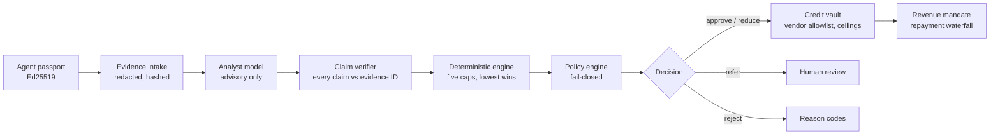
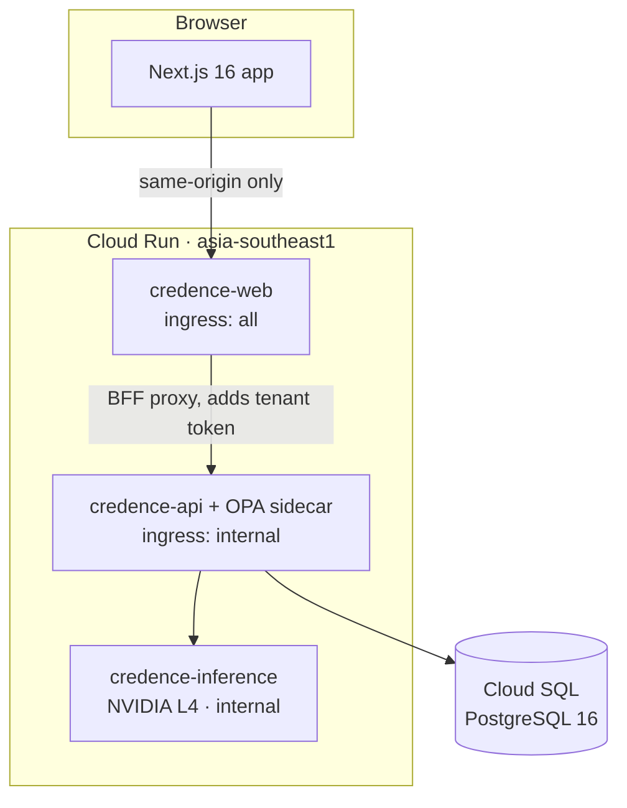

<div align="center">

# CredenceAI

### Task-backed credit infrastructure for autonomous AI agents

**A verified agent obtains short-term working capital against a specific task, spends it only through a restricted vault, and repays it automatically out of that task's revenue.**

[](https://credence-web-ppmafqinnq-as.a.run.app)
[](https://credence-web-ppmafqinnq-as.a.run.app/start)
[](https://credence-web-ppmafqinnq-as.a.run.app/judge-demo)

[](https://www.python.org/)
[](https://fastapi.tiangolo.com/)
[](https://nextjs.org/)
[](https://react.dev/)
[](https://www.typescriptlang.org/)
[](https://www.postgresql.org/)
[](https://cloud.google.com/run)
[](https://cloud.google.com/run/docs/configuring/services/gpu)
[](https://www.openpolicyagent.org/)
[](https://ed25519.cr.yp.to/)

[](#model)
[](#latency)
[](#latency)
[](#decision-quality-from-a-real-run)

[](tests/)
[](frontend/)
[](credence/policy/rego/)
[](docs/decisions/ADR-003-money-integer-minor-units.md)
[](#what-this-is-not)

</div>

---

> **Sandbox only.** No real money is accepted, custodied, lent, or transmitted.
> Every amount in the deployed system is a test credit. Built for Innova Hack ·
> FinTech PS1.

## The problem

An autonomous agent can now do the work — enrich a catalogue, run a compute job,
buy ad inventory — but it cannot pay for the inputs. Its owner has to front the
money, and the moment they do, the agent's spending is bounded only by the
owner's trust and a credit-card limit. There is no instrument that says *this
agent, for this task, up to this amount, spent only with these vendors, repaid
from this task's revenue.*

CredenceAI is that instrument.

## How a decision is made



**The model advises. Deterministic code decides. The vault enforces. Humans
handle exceptions.**

The language model is never allowed to set an amount. It produces a structured
risk opinion; a verifier re-checks every claim in it against stored evidence
IDs; and the approved limit is then computed as the smallest of five independent
caps — the amount requested, remaining owner exposure, the revenue advance cap,
the task cost cap, and the policy cap. The underwriting panel names which cap
actually bound. If the model is unavailable or returns malformed output, the
application goes to `HUMAN_REVIEW_REQUIRED` or is marked
`AI_ANALYSIS_UNAVAILABLE`. **There is no path where a model failure produces an
approval.**

## Try it in five minutes

| Step | Where |
|---|---|
| 1. Open the landing page and launch the sandbox | [credence-web…run.app](https://credence-web-ppmafqinnq-as.a.run.app) |
| 2. Register an agent — the passport is issued and re-verified in the same submission | [`/start`](https://credence-web-ppmafqinnq-as.a.run.app/start) |
| 3. Request credit against a task, with evidence | `/credit-applications` → **New credit application** |
| 4. Run underwriting and read the decision line by line | `/credit-applications/{id}` |
| 5. Open the vault, record revenue, watch the waterfall repay | `/vaults/{id}` → Repayment |
| Or skip ahead: six seeded scenarios, one click each | [`/judge-demo`](https://credence-web-ppmafqinnq-as.a.run.app/judge-demo) |

A fresh browser session gets its own tenant. Nothing you enter is visible to
anyone else's session, and cross-tenant reads fail with `CROSS_TENANT_EVIDENCE`
rather than returning empty.

> [!IMPORTANT]
> **The first underwriting run of the day takes about 5½ minutes. Later ones
> take about 40 seconds.**
>
> Underwriting makes a real call to a 24B model on a GPU that scales to zero, so
> nothing is paid for while nobody is using it. Waking it costs **258 s to load
> the weights and 76 s of warmup** before it can answer. The request timeout is
> set to 600 s to accommodate that, so a cold request completes rather than
> failing — but it does take the full time, and the button will sit and spin.
>
> Click any scenario on [`/judge-demo`](https://credence-web-ppmafqinnq-as.a.run.app/judge-demo)
> and leave it, then come back: everything after that is warm.
>
> If the model cannot be reached at all, underwriting returns
> `AI_EVIDENCE_CHECKS_UNAVAILABLE` and the application goes to
> `HUMAN_REVIEW_REQUIRED`. A model failure never produces an approval.

## What is built

### Identity — the agent passport

`credence/passport/`

An Ed25519-signed credential binding an agent to its organization, its owner,
its permitted task categories, its borrowing authority and its approved vendors.
Six checks run on every use, and all six must pass:

1. Trusted issuer and valid signature
2. Audience
3. Validity window
4. Revocation (an immediate kill switch)
5. Permitted scope — a task outside the granted categories fails `SCOPE_MISSING`
6. Single-use request nonce, against replay

Forged keys and tampered payloads are rejected under test. Registering an agent
in the UI issues the passport and then *re-verifies it against what was stored*,
because a passport the product has not checked is not evidence of anything.

### Money — integer paise, one conversion boundary

`credence/money.py` · `frontend/lib/format.ts` ·
[ADR-003](docs/decisions/ADR-003-money-integer-minor-units.md)

No float touches an amount anywhere in the system. Rupees entered in the browser
are converted to integer minor units exactly once, at submission, by a single
function; nothing downstream of it sees a rupee value and nothing between it and
the wire does arithmetic on one. An absent amount renders as `—`, never as ₹0 —
"we don't know" and "zero" are different facts and the UI refuses to conflate
them.

### Ledger — double-entry, append-only

`credence/ledger/` · [ADR-005](docs/decisions/ADR-005-ledger-append-only.md)

Balanced integer postings, idempotency keys on every write, an immutable journal
where corrections are reversals rather than edits, and trial-balance
reconciliation. Conservation is property-tested: money is neither created nor
destroyed by any waterfall.

### Audit — hash-chained events

`credence/audit/`

Every state change is chained into a tamper-evident log. `GET /v1/audit/chain/verify`
re-walks the chain and reports the first break. Raw-SQL edits and deletions are
detected under test. Chain writes take a Postgres advisory lock, so concurrent
requests cannot interleave into a false break.

### Vault — deny by default

`credence/vault/rules.py`

Credit is never handed to an agent as a balance. It is held in a vault that
checks every proposed payment against a per-transaction ceiling, per-task and
daily caps, a vendor allowlist with purpose binding, velocity limits and
split-payment detection — and freezes, revokes or expires on command. A vendor
not on the allowlist is **blocked**, not flagged.

### Repayment — a fixed waterfall

`credence/vault/waterfall.py`

Task revenue is contractually routed to the platform before anyone is paid, and
applied in a fixed order: principal → fee → reserve → owner. The reserve draw is
capped. Simulated loss is explicit and bounded. This is what makes the credit
self-repaying; it is not a promise that every facility repays.

### Policy — fail closed

`credence/policy/` · [ADR-004](docs/decisions/ADR-004-policy-opa-plus-mirror.md)

Versioned Rego (`credence.credit/v1`) with negated, fail-closed rules, plus a
semantically identical in-process evaluator sharing the same test vectors — 9/9
passing against real OPA 1.4. **In the deployed build, policy is evaluated
in-process**: the decision record carries `engine = "local"`, an OPA sidecar is
deployed alongside the API but nothing currently calls it, and the underwriting
panel prints the engine name straight from the stored record so the UI cannot
misstate where enforcement lives.

### Evidence intake

`credence/services/redaction.py`

Ten evidence types, closed set, 20 000 characters each, tenant-scoped. Before
any row is written, recognised identifiers — card numbers, GSTIN, PAN, IFSC,
labelled account numbers, Aadhaar, e-mail, Indian mobile numbers — are stripped
and replaced with a labelled placeholder, and the content hash is taken over the
redacted text so it hashes what is actually stored. Prompt-injection signatures
are detected, surfaced to the submitter and **stored rather than rejected**:
evidence is untrusted input by design, the analyst is instructed to treat
embedded instructions as a concern, and the verifier re-checks every claim
against evidence IDs regardless.

Pattern matching is a floor, not a guarantee. It will not catch a name, an
address, or an identifier written in a form nobody anticipated — which is why
the forms ship synthetic templates and ask for synthetic material.

## Architecture



The browser never holds an API credential and never learns the API's URL. All
data flows through a server-side BFF proxy in the Next.js app
(`frontend/app/api/credence/[...path]/route.ts`) which attaches the tenant
bearer token. `credence-api` and `credence-inference` are `ingress: internal` —
they are not reachable from the public internet, and the inference URL is never
exposed to the browser.

| Service | Image | Notes |
|---|---|---|
| `credence-web` | `credence-web` | Public. Next.js standalone output. |
| `credence-api` | `credence-api` + `credence-opa` sidecar | Internal ingress only. |
| `credence-inference` | `credence-inference` | 1× NVIDIA L4, `maxScale=1`, concurrency 1. A failed model pull fails startup. |

All three are deployed **by digest**, never by `:latest`, and tagged with the
commit SHA they were built from.

## Repository layout

```
credence/            FastAPI application
├─ api/              routes, BFF-facing endpoints, system intelligence, voice
├─ passport/         Ed25519 issuance and the six verification checks
├─ ledger/           double-entry postings, idempotency, reconciliation
├─ vault/            spend rules, repayment and recovery waterfalls
├─ policy/           in-process evaluator + rego/ bundle for OPA
├─ underwriting/     deterministic caps, claim verifier, reason codes
├─ modelgw/          model gateway, prompt construction, schema validation
├─ services/         credit, identity, redaction, demo scenarios
├─ evaluation/       scored evaluation of model output against fixtures
└─ localization/     explanation translation

frontend/            Next.js 16 (App Router, React 19, Tailwind)
├─ app/(product)/    18 product routes incl. /start onboarding wizard
├─ app/api/credence/ the BFF proxy — the only place a token exists
├─ components/       data, onboarding, underwriting, shell, ui
└─ lib/              api client, money formatting, query cache, types

tests/               unit · integration · security  (261 passing)
contracts/           Solidity, phase 3
infra/               Terraform module for the GCP footprint
scripts/             deploy and verification scripts
docs/                ADRs, threat model, requirements matrix, input map
```

## Running it locally

```bash
uv sync                       # Python 3.12, pinned via uv.lock
make up                       # Postgres 16 + OPA 1.4 via docker compose
make api                      # FastAPI on :8000, OpenAPI at /docs
make test                     # unit suite
make opa-test                 # 9 Rego policy tests in real OPA 1.4
uv run pytest -q              # everything: 261 tests

cd frontend
npm install
npm run dev                   # :3000, proxying to the local API
npm test                      # 72 vitest tests
```

Health: `GET /v1/health/live` and `GET /v1/health/ready`. (There is no
`/healthz`.)

## Verification

| Suite | Count | Command |
|---|---|---|
| Python unit, integration, security | 261 | `uv run pytest -q` |
| Frontend unit | 72 | `cd frontend && npm test` |
| Rego policy, in real OPA 1.4 | 9 | `make opa-test` |
| Type checking | — | `mypy credence` · `tsc --noEmit` |
| Lint | — | `ruff check` · `eslint` |

Money conservation, waterfall ordering, passport rejection paths, cross-tenant
isolation, audit-chain tamper detection and the redaction patterns all have
tests. See [`docs/REQUIREMENTS_MATRIX.md`](docs/REQUIREMENTS_MATRIX.md) for the
requirement → code → test mapping.

## Measured on the live deployment

Every number below was recorded against the deployed sandbox on 2 August 2026,
commit `d2a9393`, region `asia-southeast1`. None of it is estimated. The full
transcript is in
[`docs/FIRST_RUN_ONBOARDING_TEST.md`](docs/FIRST_RUN_ONBOARDING_TEST.md).

### Latency

| Operation | Time |
|---|---|
| Model cold start — weights loaded | **258.3 s** |
| Model cold start — warmup | **75.9 s** |
| **Cold start, total to serving** | **≈ 334 s** |
| Underwriting, warm model | **35–45 s** |
| Judge-demo scenario, warm, end to end | **36.2 – 45.7 s** |
| Every other write and read | **< 1 s** |
| Cloud Run request timeout (web, api, inference) | 600 s |

All six judge-demo scenarios, warm, one run each:

| Scenario | Result | Time |
|---|---|---|
| A · Happy path | `A_HAPPY_PATH` | 38.9 s |
| B · Overspend | `B_OVERSPEND_BLOCKED` | 42.9 s |
| C · Unknown vendor | `C_UNAPPROVED_VENDOR_BLOCKED` | 36.7 s |
| D · Split payments | `D_SPLIT_PAYMENT_DETECTED` | 45.7 s |
| E · Kill switch | `E_OWNER_KILL_SWITCH` | 42.1 s |
| F · Task failure | `F_TASK_FAILURE_BOUNDED_RECOVERY` | 36.2 s |

### Model

| | |
|---|---|
| Model | `mistral-small3.2:24b-instruct-2506-q4_K_M` |
| Quantisation | Q4_K_M |
| VRAM resident | 15 098 MiB |
| Accelerator | 1 × NVIDIA L4 |
| Scaling | min 0, max 1 — nothing is paid for while idle |
| Reachable from the browser | **No.** Internal ingress only; the URL is never exposed to a client |

### Decision quality, from a real run

| | |
|---|---|
| Model output schema valid | `true` |
| Claims traced to stored evidence | 5 supported / 0 unsupported |
| **Amounts influenced by the model** | **`false`** — every figure comes from the deterministic engine |
| Deterministic maximum | 100 000 paise, bound by `task_cost_cap_minor` |
| Reviewer attempt to exceed that maximum | rejected, `422` |
| Repayment waterfall on ₹1 500.00 | `100000` principal + `5000` fee + `45000` owner |
| Vault after repayment | `principal_outstanding: 0`, `status: REPAID` |
| Audit chain | `{"intact": true, "first_broken_seq": null}` |
| Two identical applications | identical receipt hash — the engine is deterministic |

### Live checks

| Path | Checks | Result |
|---|---|---|
| Validation and rejection — bad input, redaction, injection, cross-tenant | 23 | all as specified |
| Approval — underwriting → human review → vault → repayment | 16 | 16 passed |

These ran over HTTP against the public origin and the same BFF proxy the browser
uses. **No browser was involved** — the Chrome automation available at the time
could not inject into any page, including `example.com`. React rendering is
covered only by the 72 frontend unit tests, not by these numbers.

## What this is *not*

This section exists because the honest version is more useful than the
impressive one.

- It is **not** production software, and nothing here should be described that
  way. It is a hackathon sandbox holding test credits.
- It does **not** hold, move, or custody real money, and it is not a licensed
  lender.
- It does **not** claim perfect accuracy, zero hallucination, or complete
  security. The model is advisory and is checked; the redaction is pattern
  matching with known gaps; the threat model
  ([`docs/threat-model/`](docs/threat-model/THREAT_MODEL.md)) lists what is out
  of scope.
- It does **not** guarantee repayment. The revenue mandate makes repayment
  structural, not certain — a task that fails still fails.
- There is **no embedding model and no reranker.** Evidence retrieval is a
  tenant-scoped SQL selection on the task. The underwriting panel says exactly
  that rather than implying a vector pipeline that does not exist.
- OPA is deployed but not on the decision path in the current build; the stored
  decision record says so, and the UI reads it from there.
- Vendor payments out of a vault cannot yet be originated from the browser —
  only via a demo scenario or an authenticated API call. Remaining gaps like
  this are listed in
  [`docs/FINAL_DATA_INPUT_MAP.md`](docs/FINAL_DATA_INPUT_MAP.md).

## Documentation

| Document | What it covers |
|---|---|
| [`docs/FINAL_DATA_INPUT_MAP.md`](docs/FINAL_DATA_INPUT_MAP.md) | Every input field → the column it writes to, and what has no input path |
| [`docs/FIRST_RUN_ONBOARDING_TEST.md`](docs/FIRST_RUN_ONBOARDING_TEST.md) | The first-run flow verified against the live deployment, step by step |
| [`docs/REQUIREMENTS_MATRIX.md`](docs/REQUIREMENTS_MATRIX.md) | PS1 requirements → code → tests |
| [`docs/DEMO_SCRIPT.md`](docs/DEMO_SCRIPT.md) | The walkthrough, timed |
| [`docs/threat-model/THREAT_MODEL.md`](docs/threat-model/THREAT_MODEL.md) | Assets, adversaries, mitigations, out of scope |
| [`docs/system-intelligence-contract.md`](docs/system-intelligence-contract.md) | The system-intelligence endpoint contract |
| [`docs/decisions/`](docs/decisions/) | ADR-001 … ADR-007 |

## Licence

Not yet licensed. All rights reserved pending a decision.
